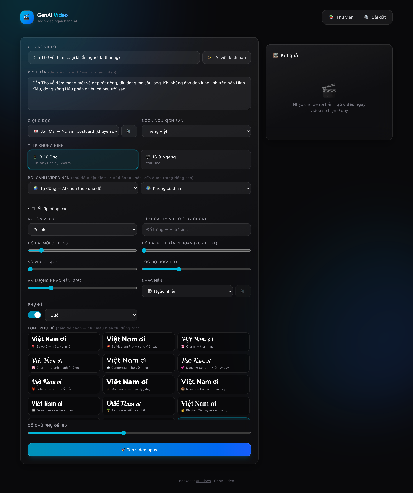
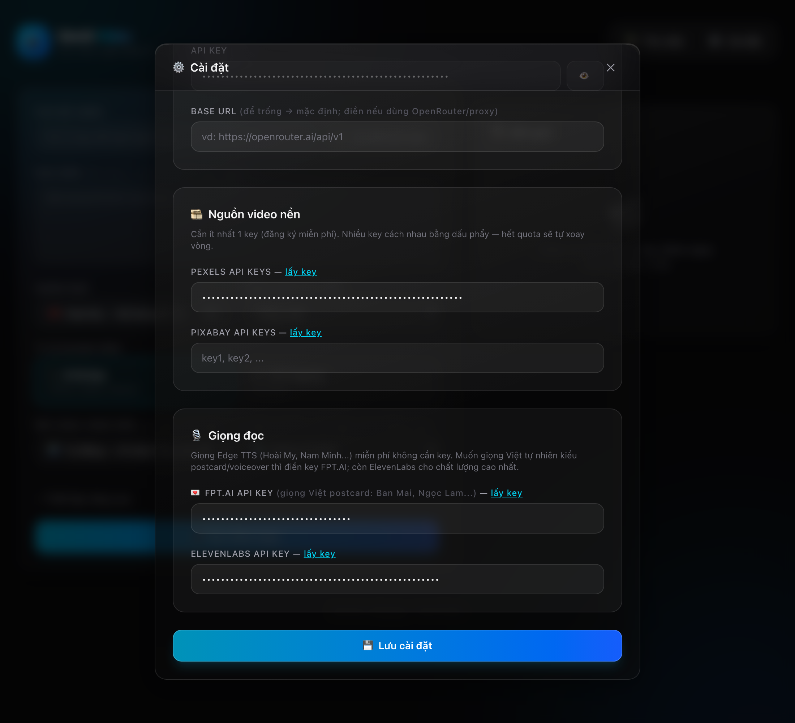
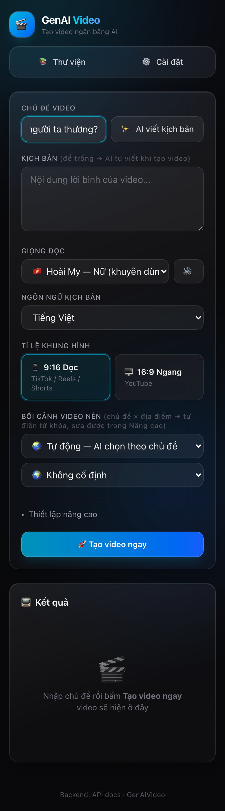

# 🎬 GenAI Video — Hướng dẫn sử dụng

Tạo video ngắn (TikTok / Reels / Shorts) tự động bằng AI: viết kịch bản → giọng đọc → phụ đề → ghép video nền → xuất MP4.

Fork từ [MoneyPrinterTurbo](https://github.com/harry0703/MoneyPrinterTurbo), thay WebUI Streamlit bằng **React frontend mới** (Vite + Tailwind, giao diện tiếng Việt) cùng nhiều fix & tính năng riêng.

## Có gì khác bản gốc

- ✨ **Frontend React mới**: glassmorphism, responsive mobile, modal Thư viện / Cài đặt
- ⚙️ **Cài đặt ngay trên web**: chọn LLM provider (18 loại), model, API key — không cần sửa file
- 🎙️ **Giọng đọc xịn**: Gemini TTS (6 giọng, free, có style "đọc postcard") + ElevenLabs (Adam, Rachel...) + Edge TTS miễn phí
- 🗺️ **Bối cảnh Chủ đề × Địa điểm**: 13 chủ đề (bình minh, hoàng hôn, cánh đồng, hoa, 3 vị chill...) × 19 địa điểm (13 mục Việt Nam + Thụy Sĩ, Nhật, Seoul, Paris, Bali, Thái) — từ khóa khảo sát thật trên Pexels, trộn sẵn modifier viral (aerial, golden hour, cinematic)
- 🎵 **14 bài nhạc postcard/chill** (Mixkit, free thương mại) — chọn đúng bài, nghe thử ngay trên web
- 🔤 **Font phụ đề TikTok Sans** — đúng look caption TikTok, đầy đủ dấu tiếng Việt, chữ trắng viền đen không hộp che cảnh
- ⏱️ **Video tới ~10 phút** (kịch bản 15 đoạn), mỗi cảnh 2–30s
- 🐛 **Fix lỗi gốc**: task treo vĩnh viễn khi lỗi, search Pexels từng-ký-tự khi LLM lỗi, phụ đề rơi sang Whisper 3GB khi lệch dòng, phụ đề chạy trước giọng đọc

## Giao diện

| Tạo video + chọn font (preview chữ thật) | Cài đặt (LLM, Pexels, FPT.AI...) | Responsive mobile |
|---|---|---|
|  |  |  |

## Cài đặt

Yêu cầu: Python 3.11+, [uv](https://docs.astral.sh/uv/), Node 18+, [pnpm](https://pnpm.io/), ffmpeg.

```bash
git clone git@github.com:qthien202/GenAIVideo.git
cd GenAIVideo

# Backend
uv sync

# Frontend
cd frontend && pnpm install && cd ..
```

## Chạy

Mở 2 terminal:

```bash
# Terminal 1 — Backend (FastAPI, port 8080)
.venv/bin/python main.py

# Terminal 2 — Frontend (Vite, port 3000)
cd frontend && pnpm dev
```

Mở **http://localhost:3000**. API docs: http://localhost:3000/docs

## Lấy API key (cần trước khi tạo video)

Mở web → nút **⚙️ Cài đặt** → điền key:

| Key | Bắt buộc | Lấy ở đâu | Free tier |
|---|---|---|---|
| **LLM** (Gemini/Groq/...) | ✅ | [Gemini](https://aistudio.google.com/apikey) · [Groq](https://console.groq.com/keys) | Có, đủ dùng |
| **Pexels** (video nền) | ✅ | [pexels.com/api](https://www.pexels.com/api/) | 200 req/giờ |
| **FPT.AI** (giọng Việt postcard) | ❌ | [console.fpt.ai](https://console.fpt.ai) | Có free tier |
| **ElevenLabs** (giọng Adam...) | ❌ | [elevenlabs.io](https://elevenlabs.io/app/settings/api-keys) | 10k ký tự/tháng |

- Key Gemini dùng cho cả **viết kịch bản lẫn giọng Gemini TTS** — 1 key 2 việc
- Không có ElevenLabs key vẫn có giọng Gemini (free) + Edge TTS (free vô hạn)
- Gemini hay dính 429 (hết quota ngày) → đổi model `gemini-2.5-flash-lite` hoặc chuyển qua Groq
- Key lưu vào `config.toml` (đã gitignore — không lo lộ key khi push)

## Tạo video

1. Nhập **chủ đề** (vd: *"Cần Thơ về đêm có gì khiến người ta thương?"*)
2. Kéo **Độ dài kịch bản** (1 đoạn ≈ 40s video, tối đa 15 đoạn ≈ 10 phút) → bấm **✨ AI viết kịch bản** hoặc tự viết
3. Chọn **giọng đọc** (bấm **🔊** cạnh ô chọn để **nghe thử ngay** — backend đọc 1 câu mẫu):
   - 💌 **FPT.AI** (Ban Mai, Ngọc Lam, Thu Minh, Lê Minh...) — giọng Việt tự nhiên kiểu voiceover TikTok, **hợp video postcard/chill nhất**; cần key FPT.AI (có free tier)
   - 🆓 **Edge** — free vô hạn, không cần key: Hoài My / Nam Minh (Việt) + Ava / Andrew / Emma / Brian (đa ngôn ngữ, đọc được tiếng Việt, rất tự nhiên) + Aria / Jenny / Guy kiểu TikTok
   - ✨ **Gemini** (Aoede, Charon, Puck...) — free với key Gemini, đọc theo style cấu hình sẵn (mặc định: ấm áp kiểu đọc bưu thiếp)
   - 🎙️ **ElevenLabs** (Adam, Rachel...) — chất nhất, cần key, 10k ký tự/tháng
4. Chọn **bối cảnh video nền** = Chủ đề × Địa điểm:
   - Chủ đề: 🌅 Bình minh / 🌇 Hoàng hôn / 🌾 Cánh đồng / 🌸 Hoa / ☕🌧️🕯️ 3 vị Chill / 🌃 Đêm phố...
   - Địa điểm: 🇻🇳 13 mục Việt Nam / 🇨🇭 Thụy Sĩ / 🇯🇵 Nhật / 🇫🇷 Paris...
   - Từ khóa ghép ra hiện ngay bên dưới (🔍), sửa tay được trong Nâng cao
5. (Nâng cao) **Nhạc nền**: chọn bài nhóm 💌 Postcard, bấm **🔊 nghe thử**; chỉnh độ dài clip, tốc độ đọc, phụ đề...
6. **🚀 Tạo video ngay** — xong thì xem + tải ngay trên web

Video lưu tại `storage/tasks/<task-id>/`. Nút **📚 Thư viện** xem lại tất cả.

> 💡 **Mẹo tiết kiệm quota LLM**: giữ kịch bản đã sinh + chọn bối cảnh preset (thay vì Tự động) → tạo video không tốn request LLM nào.

## Công thức video postcard (đề xuất)

| Thiết lập | Giá trị |
|---|---|
| Độ dài mỗi clip | **10s** (khớp ~1 câu đọc; cảnh aerial cần 8-10s mới thấy chuyển động) |
| Kịch bản | 2–3 đoạn (~1.5–2 phút) |
| Giọng | Aoede / Charon (Gemini) — style postcard đã set sẵn |
| Nhạc | Valley Sunset / Slow Walk, âm lượng 15–20% |
| Nhạc trend TikTok | **Đừng** bake vào video (dính bản quyền) — up xong thêm sound trong app TikTok, thuật toán còn ưu tiên |

Đổi style giọng Gemini: sửa `gemini_tts_style_prompt` trong `config.toml` (vd giọng hào hứng, bí ẩn, đọc tin tức...).

## Phụ đề

- **16 font chọn ngay trên web** (mục Nâng cao → Font phụ đề): bấm vào ô font là thấy **chữ mẫu hiển thị đúng kiểu** — TikTok Sans, Be Vietnam Pro, Oswald, Montserrat, Nunito, Quicksand, Comfortaa, Baloo 2, Playfair Display, Pacifico, Dancing Script, Lobster, Roboto Condensed... **tất cả đều đủ dấu tiếng Việt**
- Kéo **Cỡ chữ phụ đề** ngay dưới picker (30–100)
- Font mặc định **TikTok Sans Bold** — đúng look caption TikTok (dự phòng: Be Vietnam Pro Bold)
- Chữ trắng + viền đen, không hộp đen che cảnh
- Timeline tự né khoảng lặng đầu/cuối file TTS + nghỉ 0.3s giữa câu → khớp nhịp giọng đọc
- Muốn thêm font: thả file `.ttf` vào `resource/fonts/` → tự hiện trong picker (lưu ý chọn font có đủ dấu tiếng Việt; Anton/Bebas Neue **không** có dấu)

## Lỗi thường gặp

| Triệu chứng | Nguyên nhân → Cách xử lý |
|---|---|
| Task báo lỗi `pexels_api_keys is not set` | Chưa điền Pexels key → ⚙️ Cài đặt |
| Lỗi `429 ... exceeded your current quota` | LLM hết quota → đổi model nhẹ hơn / qua Groq / điền từ khóa tay |
| Giọng Gemini lỗi / không ra audio | Gemini TTS hết lượt ngày (quota preview hẻo) → đổi giọng Edge |
| Modal Cài đặt trống trơn | Backend chưa chạy → bật `python main.py` rồi mở lại modal |
| Sửa code backend xong không ăn | Restart backend (Ctrl+C → chạy lại); riêng key/config thì ăn ngay |
| Form gửi giá trị cũ (font, params...) | Tab mở lâu giữ state cũ → **Cmd+Shift+R** hard refresh |

## Cập nhật code mới từ repo gốc

```bash
git fetch upstream
git merge upstream/main
git push origin main
```

(`upstream` = harry0703/MoneyPrinterTurbo; `frontend/` là folder riêng nên hầu như không bao giờ conflict)
